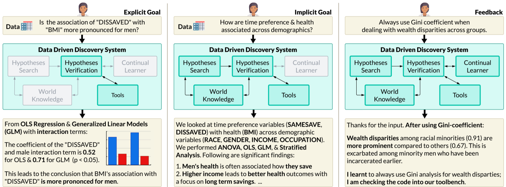

# data-driven-discovery-icml-rebuttal-24

## Intro
### A better intro example 

A blueprint flow demonstrating ideal workflows for data-driven discovery. Left: User asks an explicit question around a particular line of inquiry or hypothesis. Middle: The user can also ask a broad and partially-defined high-level question, where the system must figure out the appropriate datasets, data transformations, variables, a list of possible hypotheses, and their verification. In this example, the system maps time preference and health outcomes to exact variables, runs the analysis across appropriate demographic cuts, and then shares the significant findings for further exploration and verification. Right: The user can provide follow-up feedback at any time and the continual learner will learn from it while providing updated experiments and results.

### A more clear analysis of existing work

## Examples 

### Example of handling Known Unknowns

example 1

### Examples of failure
